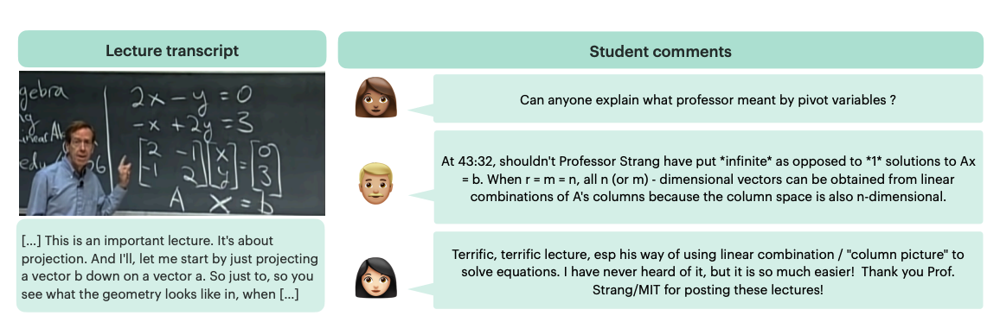

# SIGHT: A Large Annotated Dataset on Student Insights Gathered from Higher Education Transcripts

<p align="center" style="font-size: 1.5em;">
    <a href="https://huggingface.co/datasets/rose-e-wang/sight">HuggingFace</a> • 
    <a href="https://rosewang2008.github.io/sight/">Project Page</a> •
    <a href="https://arxiv.org/pdf/2306.09343.pdf">Paper</a> •
    <a href="assets/poster.pdf">Poster</a> •
    <a href="https://www.youtube.com/watch?v=Yt-2jLJLKjI">Video</a>
</p>

Authors: Rose E. Wang*, Pawan Wirawarn*, Noah Goodman and Dorottya Demszky

*= Equal contributions

In the Proceedings of Innovative Use of NLP for Building Educational Applications 2023

If you find our work useful or interesting, please consider citing it!

```
@inproceedings{wang2023sight,
  title={SIGHT: A Large Annotated Dataset on Student Insights Gathered from Higher Education Transcripts},
  author={Wang, Rose E and Wirawarn, Pawan and Goodman, Noah and Demszky, Dorottya},
  year={2023},
  month = jun,
  booktitle = {18th Workshop on Innovative Use of NLP for Building Educational Applications},
  month_numeric = {6}
}
```



## Motivation
Lectures are a learning experience for both students and teachers.
Students learn from teachers about the subject material, while teachers learn from students about how to refine their instruction.
Unfortunately, online student feedback is unstructured and abundant, making it challenging for teachers to learn and improve. We take a step towards tackling this challenge.
First, we contribute a dataset for studying this problem: SIGHT is a large dataset of 288 math lecture transcripts and 15,784 comments collected from the Massachusetts Institute of Technology OpenCourseWare (MIT OCW) YouTube channel.
Second, we develop a rubric for categorizing feedback types using qualitative analysis. 
Qualitative analysis methods are powerful in uncovering domain-specific insights, however they are costly to apply to large data sources.
To overcome this challenge, we propose a set of best practices for using large language models (LLMs) to cheaply classify the comments at scale.
We observe a striking correlation between the model's and humans' annotation: 
Categories with consistent human annotations (>$0.9$ inter-rater reliability, IRR) also display higher human-model agreement (>$0.7$), while categories with less consistent human annotations ($0.7$-$0.8$ IRR) correspondingly demonstrate lower human-model agreement ($0.3$-$0.5$).
These techniques uncover useful student feedback from thousands of comments, costing around $\$0.002$ per comment.
We conclude by discussing exciting future directions on using online student feedback and improving automated annotation techniques for qualitative research.


## Repository structure

Scripts are in `run_analysis.sh` for replicating the paper analysis. Please refer to the `prompts` directory for replicating the annotations.

The repo structure:

```
.
├── data                           
    ├── annotations         # Sample (human) and full SIGHT annotations
    ├── comments            # Per-video comments
    ├── metadata            # Per-video metadata like playlist ID or video name
    └── transcripts         # Per-video transcript, transcribed with Whisper Large V2
├── prompts                 # Prompts used for annotation
├── results                 # Result plots used in paper
├── scripts                 # Python scripts for analysis
├── requirements.txt        # Install requirements for running code
├── run_analysis.sh         # Complete analysis script
├── LICENSE
└── README.md
```

## Installation

To install the required libraries:

```
conda create -n sight python=3
conda activate sight
pip install -r requirements.txt
```

## Experiments

TLDR: Running `source run_analysis.sh` replicates all the results we report in the paper. 


Plots (e.g., the IRR comparison in Figure 3) are saved under `results/` as PDF files.
Numbers (e.g., sample data information in Table 2 or IRR values in Table 3) are printed out under `results/` as txt files.


## Annotations 

The automated annotations provided in this GitHub repository have been scaled on categories with high inter-rater reliability (IRR) scores. 
While we have made efforts to ensure the reliability of these annotations, it is important to note that the automated annotations may not be completely error-free. 
We recommend using these annotations as a starting point and validating them through additional human annotation or other means as necessary. 
By using these annotations, you acknowledge and accept the potential limitations and inherent uncertainties associated with automated annotation methods, like annotating at scale with GPT-3.5.

We welcome any contributions to improve the quality of the annotations in this repository! 
If you have made improvements to the annotations or expanded the annotations, feel free to submit a pulll request with your changes. 
We appreciate all efforts to make these annotations more useful for the education and NLP community! 
